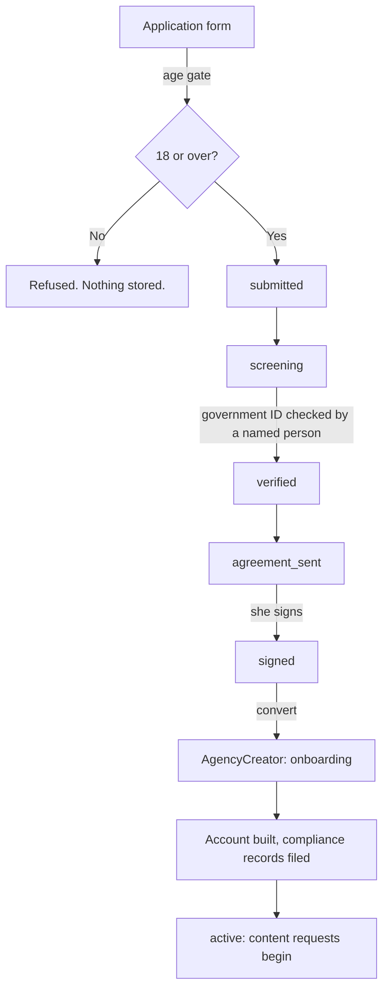

# Creator onboarding — the flow

From a stranger on the website to a creator we are paying. Six stages, each one
a gate rather than a step: nothing proceeds until the stage before it actually
happened.



## The stages

| Stage | What has to happen | Who |
|---|---|---|
| **Application** | Form submitted, age attested, age gate passed | Applicant |
| **submitted** | Sitting in the queue | — |
| **screening** | Someone reads it and decides whether to proceed | Us |
| **verified** | A named person has looked at a government ID | Us |
| **agreement_sent** | Agreement sent; she has time to read it | Us |
| **signed** | She has signed | Her |
| **Converted** | Becomes an `AgencyCreator`, status `onboarding` | Us |
| **active** | Account live, compliance complete, content requests begin | Both |

## The gates that cannot be skipped

**The age gate runs before a database row exists.** An applicant under 18 is
refused and *nothing she typed is stored* — not her name, not her email, not her
date of birth. The instinct to log the refusal "for compliance" would mean
keeping a minor's personal data in order to prove we declined to deal with her.
Holding that data is the harm. Only an anonymous count survives.

**No jumping stages.** `submitted → signed` is refused by the API, not just
hidden in the console. Each stage depends on the one before: an agreement that
went out before anyone checked an ID is exactly the sequence this prevents.

**Verification requires a verifier.** Recording `verified` without the name of
whoever checked the document is refused. A verification with no verifier is the
record that fails an inspection.

**Conversion requires a date of birth from the document.** The application never
held one — the age gate read it and discarded it. The creator's date of birth is
typed in by whoever checked the government ID, from the ID, which is the only
place it should ever come from.

## What happens after conversion

The creator exists but cannot be published or paid until
`lib/agency/compliance.js` clears her. That needs five records on file, each
verified by a named person:

1. Government ID
2. Age verification
3. Model release
4. Content licence
5. Tax form (W-9 / W-8BEN)

Until all five are in, payouts are **held with a stated reason** rather than
silently skipped, so she can be told exactly what is missing. The held balance
carries forward and is never forfeited.

`AgencyComplianceRecord` stores a *reference* to each document, never the
document. ID scans and tax forms go in secure storage; the database holds a
pointer, who checked it, when, and when it expires.

## Referral attribution

Every application carries `referredBy` — the partner or campaign that brought
her in. The whole partnership rests on it: one partner recruits and the other
operates, and a referral nobody recorded becomes an argument about who is owed
what in month six.

It is captured at the form, from the link. Send people a link with
`?ref=austin` and it is recorded automatically.

## API

| Call | Auth | Purpose |
|---|---|---|
| `POST /api/agency/applications` | **Public** | The form. Age-gated, rate-limited |
| `GET /api/agency/applications` | Admin | The pipeline, with counts by stage |
| `PATCH /api/agency/applications` | Admin | Move a stage; refuses illegal jumps |
| `PUT /api/agency/applications` | Admin | Convert to a creator |

The POST is the only unauthenticated write in the whole agency system. It is
throttled at 5 per hour per connection, caps every field, and returns the same
thank-you whether or not a row was written — a form that says "you have already
applied" tells anyone who asks whether a particular woman applied to an
adult-content agency, and that is nobody's business.

## Tests

```
node scripts/test-agency-applications.js   # 42 checks, no database needed
```

The age gate gets the heaviest coverage in the codebase: both sides of the
birthday boundary, every shape of missing or malformed input, and the
requirement that an unreadable date fails closed rather than passing as
"probably fine".
